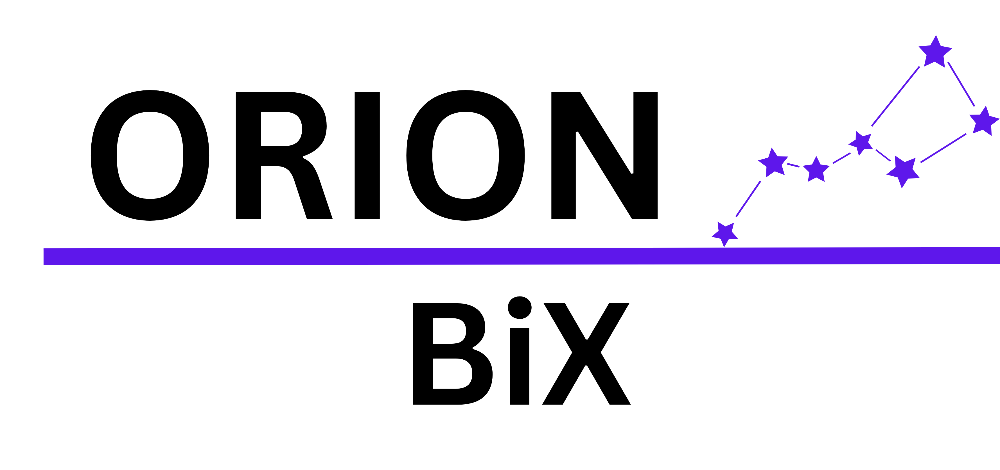
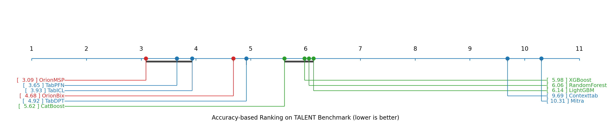
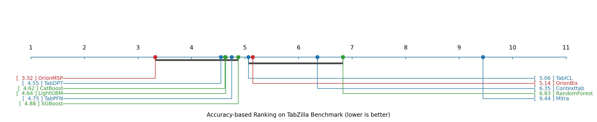
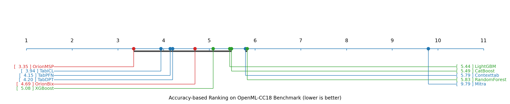
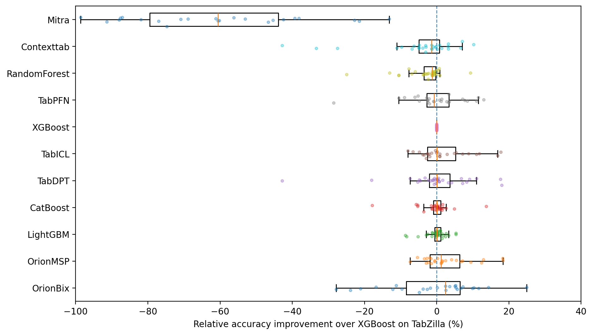

<div align="center">
  
</div>

<div align="center">
  <a href="https://www.lexsi.ai/">
    
<a href="https://huggingface.co/Lexsi/Orion-BiX">
    
  </a>
  </a>
  <a href="https://discord.gg/dSB62Q7A">
    
  </a>
</div>


# Orion-BiX: Bi-Axial Meta-Learning for Tabular In-Context Learning

[](https://www.python.org/downloads/)
[](https://pytorch.org/)
[](https://opensource.org/licenses/MIT)

**[Orion-BiX](https://arxiv.org/abs/2512.00181)** is an advanced tabular foundation model that combines **Bi-Axial Attention** with **Meta-Learning** capabilities for few-shot tabular classification. The model extends the TabICL architecture with alternating attention patterns and episode-based training, achieving state-of-the-art performance on domain-specific benchamrks such as Healthcare and Finance.

## 🏗️ Approach and Architecture

### Key Innovations

Orion-BiX introduces three key architectural innovations:

1. **Bi-Axial Attention**: Alternating attention patterns (Standard → Grouped → Hierarchical → Relational) that capture multi-scale feature interactions
2. **Meta-Learning**: Episode-based training with k-NN support selection for few-shot learning
3. **Configurable Architecture**: Flexible design supporting various attention mechanisms and training modes
4. **Production Ready**: Memory optimization, distributed training support, and scikit-learn interface

### Component Details

Orion-BiX follows a three-component architecture:

```
Input → Column Embedder (Set Transformer) → Bi-Axial Attention → ICL Predictor → Output
```

1. **Column Embedder**: Set Transformer for statistical distribution learning across features from TabICL
2. **Bi-Axial Attention**: Replaces standard RowInteraction with alternating attention patterns:
   - **Standard Cross-Feature Attention**: Direct attention between features
   - **Grouped Feature Attention**: Attention within feature groups
   - **Hierarchical Feature Attention**: Hierarchical feature patterns
   - **Relational Feature Attention**: Full feature-to-feature attention
   - **CLS Token Aggregation**: Multiple CLS tokens (default: 4) for feature summarization
3. **tf_icl ICL Predictor**: In-context learning module for few-shot prediction

Each `BiAxialAttentionBlock` applies four attention patterns in sequence:

```
Standard → Grouped → Hierarchical → Relational → CLS Aggregation
```

## Installation

### Prerequisites

- Python 3.9-3.12
- PyTorch 2.2+ (with CUDA support recommended)
- CUDA-capable GPU (recommended for training)

### From the source

#### Option 1: From the local clone

```bash
cd orion-bix
pip install -e .
```

#### Option 2: From the Git Remote
```bash
pip install git+https://github.com/Lexsi-Labs/Orion-BiX.git
```


## Usage

Orion-BiX provides a scikit-learn compatible interface for easy integration:

```python
from orion_bix.sklearn import OrionBixClassifier

# Initialize and fit the classifier
clf = OrionBixClassifier()

# Fit the model (prepares data transformations)
clf.fit(X_train, y_train)

# Make predictions
predictions = clf.predict(X_test)
probabilities = clf.predict_proba(X_test)
```

## Preprocessing

Orion-BiX includes automatic preprocessing that handles:

1. **Categorical Encoding**: Automatically encodes categorical features using ordinal encoding
2. **Missing Value Imputation**: Handles missing values using median imputation for numerical features
3. **Feature Normalization**: Supports multiple normalization methods:
   - `"none"`: No normalization
   - `"power"`: Yeo-Johnson power transform
   - `"quantile"`: Quantile transformation to normal distribution
   - `"quantile_rtdl"`: RTDL-style quantile transform
   - `"robust"`: Robust scaling using median and quantiles
4. **Outlier Handling**: Clips outliers beyond a specified Z-score threshold (default: 4.0)
5. **Feature Permutation**: Applies systematic feature shuffling for ensemble diversity:
   - `"none"`: Original feature order
   - `"shift"`: Circular shifting
   - `"random"`: Random permutation
   - `"latin"`: Latin square patterns (recommended)

The preprocessing is automatically applied during `fit()` and `predict()`, so no manual preprocessing is required.

## Performance

<div align="center">
  
</div>

<div align="center">
  
</div>

<div align="center">
  
</div>

<div align="center">
  <table>
    <tr>
      <td style="padding: 5px;"></td>
    </tr>
  </table>
</div>

## Citation

If you use Orion-BiX in your research, please cite our [paper](https://arxiv.org/abs/2512.00181):

```bibtex
@article{bouadi2025orionbix,
      title={Orion-Bix: Bi-Axial Attention for Tabular In-Context Learning}, 
      author={Mohamed Bouadi and Pratinav Seth and Aditya Tanna and Vinay Kumar Sankarapu},
      year={2025},
      eprint={2512.00181},
      archivePrefix={arXiv},
      primaryClass={cs.LG},
      url={https://arxiv.org/abs/2512.00181}, 
}
```

## License

This project is released under the MIT License. See [LICENSE](LICENSE) for details.

## Contact

For questions, issues, or contributions, please:
- Open an issue on [GitHub](https://github.com/Lexsi-Labs/Orion-BiX/issues)
- Join our [Discord](https://discord.gg/dSB62Q7A) community


## 🙏 Acknowledgments

Orion-BiX is built on top of [TabICL](https://github.com/soda-inria/tabicl), a tabular foundation model for in-context learning. We gratefully acknowledge the TabICL authors for their foundational work and for making their codebase publicly available.
