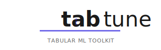

<div style="text-align: center;">
  
</div>


---

**TabTune** is a powerful and flexible Python library designed to simplify the training and fine-tuning of modern foundation models on tabular data.  
It provides a high-level, scikit-learn-compatible API that abstracts away the complexities of data preprocessing, model-specific training loops, and benchmarking, letting you focus on delivering results.

Whether you are a practitioner aiming for production-grade pipelines or a researcher exploring advanced architectures, TabTune streamlines your workflow for tabular deep learning.

---

## 🚀 TabTune v1.0 - First Release

**Welcome to TabTune! This initial release provides a complete, production-ready framework for tabular foundation models.**

**Core Components:**

- **Unified API (`TabularPipeline`):** Single, scikit-learn-compatible interface for all models with `.fit()`, `.predict()`, `.save()`, and `.load()` methods.
- **Smart Data Processing (`DataProcessor`):** Model-aware preprocessing that automatically handles imputation, scaling, categorical encoding, and feature transformations for each model.
- **Flexible Tuning (`TuningManager`):** Three tuning strategies—zero-shot `inference`, supervised fine-tuning (`base-ft`) with full parameter updates, and memory-efficient `peft` (LoRA) adapters. Supports episodic meta-learning for ICL models.
- **Model Comparison (`TabularLeaderboard`):** Systematic benchmarking tool for comparing multiple models and strategies on your datasets.

**Supported Models (7 Models):**

- **TabPFN-v2:** Fast Bayesian inference for small datasets (<10K rows) with experimental PEFT support.
- **TabICL:** Scalable ICL with two-stage attention, full PEFT support, ideal for 10K-1M row datasets.
- **OrionMSP:** Multi-scale prior ICL for balanced generalization on 50K-2M+ row datasets, full PEFT support.
- **OrionBix:** Biaxial interaction expert for high-accuracy scenarios (50K-2M+ rows), full PEFT support.
- **TabDPT:** Denoising transformer for very large datasets (100K-5M rows), full PEFT support.
- **Mitra:** 2D cross-attention model for complex patterns and mixed data types, full PEFT support.
- **ContextTab:** Semantics-aware ICL with text embedding integration, experimental PEFT support.

**Key Capabilities:**

- ✅ **Multiple Training Paradigms:** Supports supervised fine-tuning (SFT) with full parameter updates, episodic meta-learning for in-context learning models, and parameter-efficient PEFT strategies.
- ✅ **PEFT (LoRA) Support:** Parameter-efficient fine-tuning for 5 out of 7 models (TabICL, OrionMSP, OrionBix, TabDPT, Mitra) with full support.
- ✅ **Meta-Learning Integration:** Episodic training with support/query sets for ICL models (TabICL, OrionMSP, OrionBix, Mitra) enabling fast task adaptation.
- ✅ **Comprehensive Documentation:** Extensive guides, API references, troubleshooting, and model-specific documentation.
- ✅ **Production Ready:** Model serialization, reproducible training, and deployment-ready pipelines.
- ✅ **Extensible Architecture:** Modular design for easy integration of custom processors and models.

---

## ⭐ Core Features

- **Unified API:** Single interface for model training, inference, and evaluation across multiple tabular model families.
- **Automated Preprocessing:** Model-aware data processing for feature scaling, encoding, imputation, and transformation.
- **Flexible Fine-Tuning:** Choose between zero-shot inference, full fine-tuning, or memory-efficient PEFT strategies.
- **Model Comparison:** Built-in leaderboard for systematic benchmarking and strategy evaluation.
- **Extensible Design:** Modular codebase for easy integration of custom data processors and models.

------------------------------------------------------------------------

## 📦 Supported Models (Updated)

  ---------------------------------------------------------------------------------
  Model            Family              Key Innovation                PEFT
  ---------------- ------------------- ----------------------------- --------------
  **TabPFN-v2**    PFN / ICL           Bayesian synthetic prior      ⚠️
                                                                     Experimental

  **TabICL**       Scalable ICL        Two-stage column-row          ✅
                                       attention                     

  **OrionMSP       MSP-ICL             Multi-Scale Prior             ✅
  v1.0**                                                             

  **OrionMSP       MSP-ICL (Enhanced)  Stabilized prototype          ⚠️
  v1.5**                               refinement                    

  **Orion BIX**    Scalable ICL        Biaxial Interaction eXpert    ✅

  **TabDPT**       Denoising           Masked feature pretraining    ✅
                   Transformer                                       

  **Mitra**        2D Cross Attention  Cross-axis interaction        ✅
                                       modeling                      

  **ContextTab**   Semantics-Aware ICL Text-augmented embeddings     ⚠️

  **LimiX**        Linear-Structured   Efficient low-rank structure  Not Supported
                   Model               learning                      
  ---------------------------------------------------------------------------------

------------------------------------------------------------------------

## 🆕 New in This Release

#### ✅ OrionMSP v1.5 and Limix Model Support

### Regression Framework

-   Unified regression training API
-   Standardized metric handling
-   Benchmark-ready evaluation utilities

### Resampling Module

-   Context-aware support/query sampling
-   Configurable episodic batching
-   Optimized for ICL models

------------------------------------------------------------------------
## ⚡ Quick Start

```python
import pandas as pd
from sklearn.model_selection import train_test_split
import openml
from tabtune import TabularPipeline

# Load dataset
dataset = openml.datasets.get_dataset(42178)
X, y, _, _ = dataset.get_data(target=dataset.default_target_attribute)
X_train, X_test, y_train, y_test = train_test_split(X, y, test_size=0.25, random_state=42)

# Init and fit pipeline
pipeline = TabularPipeline(
    model_name="TabPFN",
    task_type="classification",
    tuning_strategy="base-ft",
    tuning_params={"device": "cpu"}
)
pipeline.fit(X_train, y_train)

# Save and load pipeline for prediction
pipeline.save("churn_pipeline.joblib")
loaded_pipeline = TabularPipeline.load("churn_pipeline.joblib")
predictions = loaded_pipeline.predict(X_test)
metrics = pipeline.evaluate(X_test, y_test)
print(metrics)
```

---

## 📝 Why TabTune?

- **No Boilerplate:** Avoids repetitive code for model-specific data loading, training, and inference.
- **Consistent Results:** Automates best practices for tabular DL research and model selection.
- **Fast Iteration:** Easily compare new models with your data, using the same consistent API.
- **Production Ready:** Model and config serialization for robust deployment and reproducibility.
- **Community-Driven:** Extensible design and open contribution policy.

---

### Google Colab Support

- TabTune auto-detects Colab sessions, skipping optional IPython-heavy integrations (e.g., rich leaderboard display) so installs succeed with Colab’s preinstalled packages.
- In Colab, install with `pip install "tabtune[colab]"` to keep core runtime packages (NumPy, pandas, scikit-learn, IPython) on the versions Colab expects.
- For richer notebook display helpers outside Colab, opt into `pip install "tabtune[interactive]"`.

---

## 📑 Explore the Documentation

- **[Getting Started](getting-started/installation.md):** Installation, setup, and basic usage.
- **[User Guide](user-guide/pipeline-overview.md):** In-depth tutorials for each component.
- **[Supported Models](models/overview.md):** Model details and design notes.
- **[Advanced Topics](advanced/peft-lora.md):** PEFT/LoRA, custom preprocessing, and more.
- **[API Reference](api/pipeline.md):** Complete Python API and class/method details.
- **[Examples & Benchmarks](examples/classification.md):** End-to-end code notebooks.

---

## 🏆 Example Notebooks

|Below are 11 Example Notebooks showcasing all the features of the Library in-depth!

| Serial No. | Name | Task Performed | Link To Notebook |
|---|------|------|------|
| 1 | Unified API | Showcasing A Unified API Across Multiple Models |[](https://colab.research.google.com/drive/1KcaSdYRjZnMlb0MLmQ5IlnbPDiuEr1Ld?usp=sharing) |
| 2 |  Automated Model-Aware Preprocessing | The Automated preprocessing system explained |[](https://colab.research.google.com/drive/12BQ12VJrxtTDslgjnjm26yi3a0PYXqZT?usp=sharing) |
| 3 | Fine-Tuning Strategies | TabTune's four fine-tuning strategies |[](https://colab.research.google.com/drive/1QixfiNCjF1IQV9NooMipPpnH4ETcEQwg?usp=sharing) |
| 4 | Model Comparison | Model Comparison with TabularLeaderboard |[](https://colab.research.google.com/drive/1PZW3iPQOvwh0kroGytMzYTGc6ZVUzuvg?usp=sharing) |
| 5 | Checkpoint Management | Checkpoint Management - Save/Load Pipelines |[](https://colab.research.google.com/drive/1DBTGEPpYLJjU9Aj7lzHoX3JtwaNOC0jn?usp=sharing) |
| 6 | Advanced Usage | PEFT Configuration and Hybrid Strategies |[](https://colab.research.google.com/drive/1V3XGLeKrXSJwavaULMncZiM7uVE8sz0h?usp=sharing) |
| 7 |  Resampling |  Resampling Strategies |[](https://colab.research.google.com/drive/1EHGrrSm7EalVRvzkH1RUHsNSLzmn10lM?usp=sharing) |
| 8 | Regression - 1| Introduction to Regression - Inference |[](https://colab.research.google.com/drive/1lBt0QZWqlwhEg2ul_nVPAeC-w3Are0At) |
| 9 | Regression - 2| Introduction to Regression - Inference |[](https://colab.research.google.com/drive/1FFuaRBDtJZFAQF-JDIxRAjtgOZ1rmHd1?usp=sharing) |
| 10 | Evaluation Metrics | Evaluation Metrics involved |[](https://colab.research.google.com/drive/18TxyTyBGAGrIVf6zLjURDChG0vM4V02M?usp=sharing) |
| 11 | Benchmarking | Standard Benchmarking Techniques |[](https://colab.research.google.com/drive/1lcoVMPz_3X5_5taNdB9doTGoN05krNRw?usp=sharing) |


---

## 📂 Project Structure

```
tabtune/
├── Dataprocess/
├── models/
├── TabularPipeline/
├── TuningManager/
├── TabularLeaderboard/
├── benchmarking/
├── data/
├── logger.py
└── run.py
```

See [User Guide](user-guide/pipeline-overview.md) for a full file/module breakdown.

---

## 🏢 Developed by Lexsi Labs

<div style="text-align: center; margin: 30px 0;">
  
  <p style="font-size: 1.1em; color: #666; margin-top: 10px;">
    Created by the team at <strong>Lexsi Labs</strong>, TabTune extends frontier AI research into the tabular domain.
  </p>
</div>

---

## 🗃️ License

This project is released under the MIT License.  
Please cite appropriately if used in academic or production projects.

**BibTeX Citation:**

```bibtex
@misc{tanna2025tabtuneunifiedlibraryinference,
      title={TabTune: A Unified Library for Inference and Fine-Tuning Tabular Foundation Models}, 
      author={Aditya Tanna and Pratinav Seth and Mohamed Bouadi and Utsav Avaiya and Vinay Kumar Sankarapu},
      year={2025},
      eprint={2511.02802},
      archivePrefix={arXiv},
      primaryClass={cs.LG},
      url={https://arxiv.org/abs/2511.02802}, 
}
```

---

## 📫 Join Community / Contribute

- Issues and discussions are welcomed on the [GitHub issue tracker](https://github.com/Lexsi-Labs/TabTune/issues).
- Please see the **Contributing** section for contribution standards, code reviews, and documentation tips.

---

**Get started with TabTune and accelerate your tabular deep learning workflows today!**
