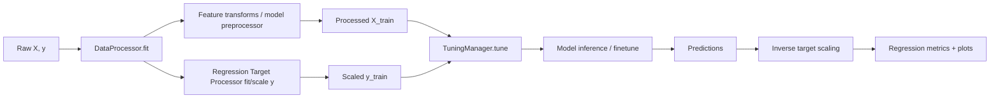

# TabTune Regression Framework

TabTune supports **end-to-end regression workflows** (training, inference, evaluation, and benchmarking) through the same `TabularPipeline` API used for classification, enabled via `task_type="regression"`.

This document explains how regression is implemented in the TabTune codebase and how to use it effectively.

---

## 1. Introduction

**What is “Regression mode” in TabTune?**

When `task_type="regression"`, TabTune switches:

- **Model wrappers** to regression-specific adapters (e.g., `TabPFNRegressorWrapper`, `TabDPTRegressorWrapper`, `MitraRegressorWrapper`, `LimixRegressorWrapper`, `ConTextTabRegressorWrapper`)
- **Target processing** to regression-specific scaling and (model-specific) target transforms
- **Evaluation** to regression metrics such as RMSE / MAE / R²

Regression mode is activated at pipeline construction time:

```python
from tabtune import TabularPipeline

pipeline = TabularPipeline(
    model_name="Limix",
    task_type="regression",
    tuning_strategy="inference",
)
```

---

## 2. High-Level Architecture

### 2.1 Pipeline Flow



---

## 3. Supported Regression Models

TabTune regression is implemented via **regression wrappers** that standardize:
- preprocessing expectations
- calling conventions (`fit`, `predict`)
- optional finetune behavior

| Model Name (`model_name`) | Wrapper Class | Default Strategy |
|---|---|---|
| `TabPFN` | `TabPFNRegressorWrapper` | inference |
| `ContextTab` | `ConTextTabRegressorWrapper` | inference / finetune |
| `TabDPT` | `TabDPTRegressorWrapper` | inference/finetune  |
| `Mitra` | `MitraRegressorWrapper` | inference/finetune |
| `Limix` | `LimixRegressorWrapper` | inference/finetune |


---

## 4. Core API Usage

### 4.1 Inference-Only Regression

```python
from tabtune import TabularPipeline

pipeline = TabularPipeline(
    model_name="TabPFN",
    task_type="regression",
    tuning_strategy="inference",
)

pipeline.fit(X_train, y_train)
pred = pipeline.predict(X_test)
metrics = pipeline.evaluate(X_test, y_test)

print(metrics["rmse"], metrics["r2_score"])
```

### 4.2 Regression Fine-Tuning

TabTune’s regression fine-tuning is implemented through `TuningManager` and is currently most explicit for **ContextTab regression** (episodic fine-tuning).

```python
pipeline = TabularPipeline(
    model_name="ContextTab",
    task_type="regression",
    tuning_strategy="finetune",
    tuning_params={
        "device": "cuda",
        "epochs": 1,
        "steps_per_epoch": 200,
        "context_size": 256,
        "query_size": 64,
        "lr": 1e-5,
        "weight_decay": 0.01,
        "clip_grad_norm": 1.0,
        "seed": 42,
    }
)
pipeline.fit(X_train, y_train)
```

If you attempt regression finetuning for a model that is not enabled by the pipeline’s regression finetune validation, TabTune raises a clear error.

---

## 5. Regression Metrics & Evaluation

TabTune computes **comprehensive** regression metrics during `evaluate()`.

### 5.1 Standard Regression Metrics

Returned metrics include:

- `mse`
- `rmse`
- `mae`
- `r2_score`
- additional metrics like median absolute error, explained variance, max error

Example:

```python
results = pipeline.evaluate(X_test, y_test)
print(results)
```

### 5.2 Residual Diagnostics

The pipeline includes utilities for residual analysis and saving plots (where supported):

- residual plots
- error distributions

Use these for debugging calibration and identifying heteroscedasticity.

---

## 6. Important Parameters

Regression-specific parameters are mostly configured through:

- `task_type="regression"` (required)
- `model_params` (model-level behavior)
- `tuning_params` (finetune behavior if enabled)
- `proc_params` / `processor_params` (target scaling & preprocessing)

A few key knobs:

| Parameter | Where | Typical Values | What it does |
|---|---|---|---|
| `task_type` | pipeline | `regression` | switches entire framework |
| `target_scaling_strategy` | processor | `standard`, `minmax`, `robust`, `power_transform`, `none` | scales y |
| `tuning_strategy` | pipeline | `inference`, `finetune` | regression adaptation mode |
| `context_sampling_strategy` | processor | (see resampling docs) | controls context selection |

---

## 7. Saving & Loading

TabTune’s `TabularPipeline` supports persistence via `joblib`:

```python
pipeline.save("regressor.joblib")
loaded = TabularPipeline.load("regressor.joblib")
pred = loaded.predict(X_test)
```

This is the recommended way to package a regression workflow for reuse.

---

## 8. Troubleshooting

### Issue: “RegressionDataProcessor must be fitted before transform”
**Cause:** calling `transform(y)` before `fit(y)` in custom flows.  
**Fix:** always call `pipeline.fit(X, y)` before `predict/evaluate`.

### Issue: “Regression finetuning is not enabled for model …”
**Cause:** finetune was requested but the model is not enabled by the pipeline’s guard.  
**Fix:** use `tuning_strategy="inference"` or switch to a supported model (e.g., ContextTab regression finetune).

### Issue: Predictions look “scaled”
**Cause:** target scaling is enabled, but inverse scaling wasn’t applied in a custom path.  
**Fix:** use pipeline APIs (they handle inverse scaling), or manually call `processor.regression_processor_.inverse_transform()` when needed.

---

## 9. Next Steps

- **Target scaling & processors:** `regression_data_processing.md`
- **Benchmark suites:** `regression_benchmarking.md`
- **Model-specific docs:** see model pages (e.g., `limix.md`) for model internals and parameters.
